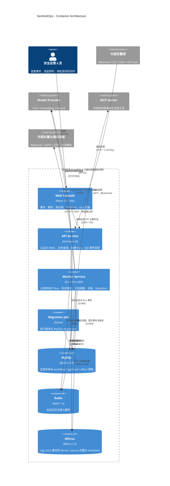
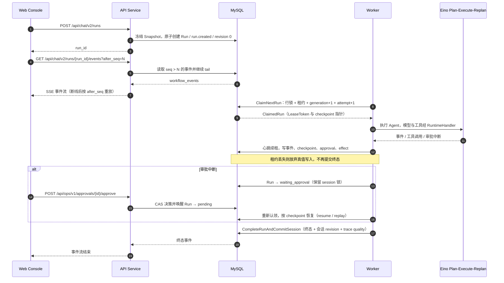
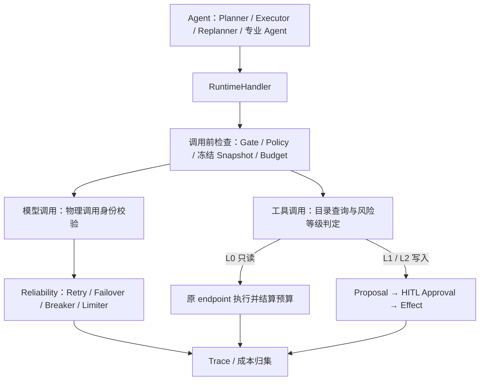
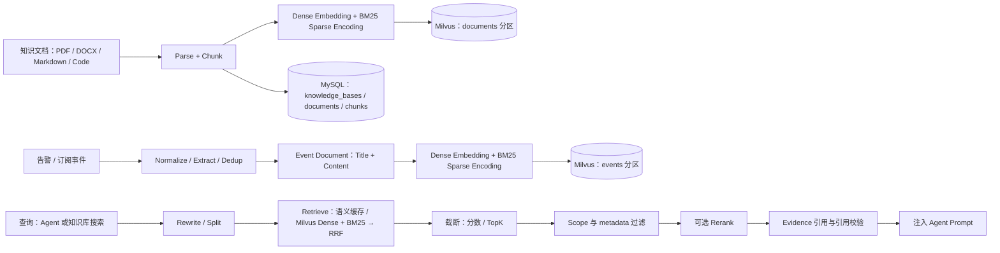

# SentinelOps

[](https://github.com/05allan1213/SentinelOps/actions/workflows/pr.yml) [](https://go.dev/) [](https://github.com/cloudwego/eino)

面向安全运营的 AI 研判与响应平台，核心是一套 **Durable Agent Runtime**：把 Agent 的规划、执行、暂停审批、恢复重放和副作用落账，从进程内状态提升为可恢复、可审计、可治理的工程链路。

它回答的不只是“模型说了什么”，还有“运行到哪一步、谁批准了什么、哪些副作用已经真的发生”。判定一次运行的结果时，以 MySQL 中的 Run 状态、workflow event 与 Approval/Effect 账本为准，而不是以模型输出或前端渲染为准。

| 核心能力 | 工程含义 |
| --- | --- |
| **Durable Agent Runtime** | API 不持有 Agent 执行权，负责创建/查询 Run、事件流与控制面请求；独立 Worker 通过 claim + lease / generation fencing 独占 Durable Run 执行，支持 heartbeat、过期回收、恢复与重放。 |
| **Safe HITL Side Effects** | 高风险工具先冻结 Proposal，经人工审批后以稳定幂等键落 Effect 账本；外部结果不可判定时停车对账，而不是盲目重放副作用。 |
| **Evidence-aware RAG** | 知识文档经解析分块、安全事件经归一化后分别向量化进入 Milvus；检索按 Access Scope fail-closed 过滤，命中的内容以带引用校验的 Evidence 注入 Agent。 |
| **Governed Model / Tool Runtime** | Durable Agent 中的 ChatModel 与 Tool 调用统一经过 `RuntimeHandler`：Gate、Policy、冻结 Snapshot、预算与 Trace 在同一治理边界生效。 |



---

## Overview

安全运营场景的难点不在“让模型回答一个问题”，而在三件事同时成立：结论要有证据、执行过程要能中断和恢复、对外部系统的写操作要可审计且不可盲目重放。SentinelOps 把这些需求拆成四个工程支柱：

1. **持久化执行**：一次用户请求或事件研判被固化为不可变的 Run，执行权由 Worker 通过带 generation 的租约独占，进程崩溃、租约过期、审批中断都不会丢失运行状态。
2. **受控副作用**：模型只能提出动作；真正的写入由 Proposal → Approval → Effect 账本完成，账本与领域写在同一事务内提交，外部调用则单独记录执行状态。
3. **证据优先**：知识库文档与安全事件进入 Milvus，检索结果按作用域过滤并携带引用，回答会区分 grounded 结论、推断与证据不足。
4. **统一治理**：Durable Agent 内的 ChatModel 与 Tool 调用经过同一个 `RuntimeHandler`，Gate、Policy、冻结身份、预算与 Trace 不会散落在各个 Agent 中；Embedding、Retrieval、Rerank 等 RAG 组件沿各自的预算与 Trace 链路执行。

### 与普通 Agent Demo 的区别

普通 Demo 把执行状态放在进程内存里，把模型输出当作结果，把工具调用直接打到外部系统。SentinelOps 把这三件事都变成了数据库事实：

- 事件真值是 append-only 的 `workflow_events`，按 `(run_id, seq)` 单调递增，SSE 断线后可以按 `after_seq` 重放；
- 执行权是带 `lease_generation` 的凭证，过期 Worker 的任何写入都会被拒绝；
- 副作用是 `agent_effects` 账本中的稳定身份，重复提交只会复用已经成功的记录；
- 运行创建时会冻结 Runtime Snapshot，执行阶段的有效 Gate 取 frozen capability 与 current effective Gate 的交集：后续 Gate 放宽不会让已有 Run 获得创建时未冻结的能力，Gate 收紧则会立即 fail-closed。

---

## Architecture

### System Context

系统面向两类外部输入：安全运营人员通过 Web Console 操作，外部告警源通过 Webhook / CEF / LEEF / API Push 推送事件。系统对外依赖三类外部服务：模型 Provider（Chat、Embedding、Rerank）、可选的 MCP Server，以及可选的处置/通知系统（Webhook、SMTP、钉钉、企业微信）。除模型 Provider 之外，其余外部集成都是可选能力，都需要显式配置与凭据。

### Container Architecture

首屏的 Container 图只包含真实可部署单元：Web Console、API Service、Worker Service、Migration Job 四个进程级单元，以及 MySQL、Redis、Milvus 三个基础设施容器。

以下内容**不是** Container，只是 API 或 Worker 进程内部的实现：Go package、Eino Graph / Agent Pipeline、`internal/ai/workflow` 的状态机、`RuntimeHandler` 中间件、模型路由与可靠性包装。把它们画成独立部署单元会误导读者对部署边界的理解。

### API / Worker Execution Model

同一个二进制由 `main.go` 解析角色参数或 `SENTINELOPS_ROLE`，拆成三种运行角色：

| 角色 | HTTP | 后台执行 | 约束 |
| --- | --- | --- | --- |
| `api` | 绑定 `:8001` | 知识索引 Worker Pool；不启动 durable Worker 与订阅调度器 | 负责认证、业务查询、创建/查询 Run、事件流与控制面 API |
| `worker` | 不绑定 HTTP | durable Worker、知识索引 Worker Pool、订阅调度器、Retention | 生产环境下的 Durable Agent 执行主体 |
| `all` | 绑定 `:8001` | 同时启动以上两者 | 仅允许 `app.environment = development`；未指定角色时的默认值 |

在 Agent 执行这件事上，两者职责是分离的：

```text
API    : 创建/查询 Run、读取并推送事件、提交控制面命令（不执行 Agent，不持有执行权）
Worker : Claim Run、续租心跳、执行 Agent、写事件与 checkpoint、收敛终态、对账
```

因此浏览器断线只影响读取，不影响正在执行的 Worker；反过来，API 进程重启也不会丢失任何 Run。API / Worker 的分离指的是 **Durable Agent 执行权**的分离，而不是 API 进程完全没有后台 goroutine。

---

## Durable Agent Runtime

这是项目的主线。一次运行涉及的概念与职责如下：

| 概念 | 作用 |
| --- | --- |
| **Run** | 一次执行的不可变输入（agent、query、冻结的 Runtime Snapshot、预算上限）与状态机载体。 |
| **Claim** | Worker 以 `SELECT ... FOR UPDATE SKIP LOCKED` 原子认领一个可执行 Run，只认领 `runtime_mode = durable_v1` 且兼容哈希与自身冻结指纹一致的 Run。 |
| **Lease / Generation** | 认领时写入 owner、租约到期时间并令 `lease_generation` 单调递增；此后所有真值写入都必须携带匹配的 `LeaseToken`，否则返回 `ErrLeaseLost`。 |
| **Attempt** | 一次认领对应一个 attempt，记录 worker、generation、兼容哈希与 trace 关联，是查询投影而不是真值。 |
| **Workflow Event** | append-only 事件真值（`run.created`、`run.claimed`、`approval.*`、`effect.*`、`run.completed` 等），SSE 与 Runtime 时间线都从这里读。 |
| **Checkpoint** | 实现 Eino 官方 `adk.CheckPointStore` / `adk.CheckPointDeleter` 契约，按 lease generation 落库并记录 payload 指纹，用于恢复与审批绑定。 |
| **Recovery** | 依据 Run 状态、checkpoint 完整性与兼容哈希选择 resume、replay 或停车；恢复命令本身也是持久化、幂等的 Operation。 |
| **Runtime Snapshot** | 冻结模型、工具、Skill、MCP catalog、Policy 与 Feature Gate 身份并形成 compatibility hash，定义该 Run 的执行兼容性与能力上限；运行时仍会与当前 effective Gate 求交集。 |
| **RuntimeHandler** | Durable Agent 中模型与工具调用的统一治理边界，见下文。 |



### RuntimeHandler

`RuntimeHandler` 是 Durable Run 的唯一 Model / Tool governance boundary，以最外层中间件挂在 Agent 上，并覆盖模型的 Generate / Stream 与所有工具调用入口（invokable、streamable、enhanced 变体）。每个 Agent 都不需要自己实现一套安全与可靠性逻辑。



它同时承担这些职责：Gate 判定（静态能力与动态开关取交集）、工具目录与权限校验、冻结 Snapshot 身份校验（模型与工具必须在 Run 创建时冻结的目录内）、预算预留与结算、Trace 与成本归集、以及 HITL 审批与 Effect 路由。模型侧的可靠性由 `internal/ai/models` 提供：Provider → Model Catalog → Routing 逐层解析出有序候选，按 provider-qualified catalog ref 隔离 Retry、Failover、Breaker 与 Limiter，每次物理调用都有独立的预算预留身份。

---

## Safe Side Effects

模型可以提出动作，但不能直接产生副作用。Durable 路径上的写操作按下面的顺序收敛：

1. **工具目录与风险等级**：`internal/ai/policy` 维护工具目录（L0 只读 / L1 / L2、effect 类型、effect 步骤）。未知工具 fail-closed。
2. **Proposal 冻结**：mutation 工具调用被转换为 canonical JSON，并冻结为稳定 `proposal_hash`。同一提案的重复提交得到同一个身份。
3. **HITL 审批**：审批记录分两阶段发布（`preparing` → `pending`），绑定 checkpoint 指纹与 generation；Run 进入 `waiting_approval`，释放 Worker 占用但保留会话锁。
4. **恢复前的再授权**：Worker 重新认领后，会重新比对工具名与版本、schema hash、参数 canonical 形式、Policy hash、Runtime 兼容哈希与写 Gate，然后才允许继续。
5. **Effect 执行**：`Transactional` effect 的领域写入与账本状态在同一个数据库事务内提交；`External` effect 先建立稳定 DAG 身份再调用外部系统，其超时上界不得超过当前租约的安全边界。
6. **对账**：外部调用结果无法判定（超时、网络不确定）时，Run 不会被标成成功，而是原子地停车为 `effect_unknown`；随后由 Worker 自动对账，或由管理员通过 `GET /api/ops/v1/effects/unknown` 查询待处理 Effect，再通过 `POST /api/ops/v1/effects/{id}/resolve` 或 `POST /api/ops/v1/effects/{id}/accept-unknown` 显式决议。

关于幂等与重试，可以严格承诺的是：每个 effect step 有稳定的幂等键，重复提交会复用已成功的账本记录而不是重放领域写入；Durable 真值写入受 generation fencing 保护；无法确认外部调用是否已经发生时，Runtime 会把 Run 停在对账状态，而不是盲目重放副作用。

写能力的开关由两层 Gate 同时决定：静态配置（`agent_runtime.enabled`、`l1_writes`、`l2_writes` 等）只提供能力上限，动态开关存放在 `settings` 表。任何一层关闭都会关闭能力；`shadow_mode` 打开时会强制关闭 L1/L2 写入，即使静态开关为 true。

---

## Evidence & Knowledge

知识有两条接入路径，最终都写入 Milvus 的 `rag_store` 集合，并且都同时保存 dense 向量（COSINE）与 BM25 sparse 向量：

- **知识文档**：PDF、DOCX、Markdown 与 Go/Python/Java 代码，经 Parser 解析后按文件类型选择 hierarchical / sliding_window / code 策略分块，再写入 `documents` 分区；MySQL 保留知识库、文档与分块元数据。
- **安全事件与情报**：告警接入或订阅抓取得到的事件经归一化、抽取与去重后，直接由标题与正文构成 Event Document 写入 `events` 分区，不经过文档 Parser 与文档分块。

查询进入系统的路径：可选查询改写与拆分 → 向量化 → Redis 语义缓存 → Milvus 混合检索（dense + BM25，按 RRF 融合，失败时回退 dense）→ 分数与条数截断 → 作用域过滤 → 可选 Rerank → 作为 Evidence 注入 Agent Prompt。`documents` 分区的过滤是 fail-closed 的：缺少证据作用域或 MySQL 真值不可用时返回“证据不可用”，而不是放宽过滤条件。



**MCP** 与 **Skill** 是 Runtime 的扩展能力，而不是项目主角：

- MCP 由配置驱动，逐个 server 限制 transport、URL 与 host/port allowlist、工具白名单、超时与结果大小；Header 只允许 Secret 引用，接入时会做 SSRF 与 stdio 参数校验。动态发现的工具目录会参与冻结身份（catalog hash），非只读工具不会因为“动态发现”而绕过 Policy；关闭 `mcp.enabled` 时不会建立 session。
- Skill 使用官方 Eino Skill middleware 与只读的本地文件系统 backend，限制目录大小与字节上限，并受 L0 工具白名单与 Gate 约束。`manifest/skills/` 中提供 `evidence-summary`、`incident-triage`、`response-checklist` 三个示例。

---

## Security Operations

**告警接入**：Webhook、CEF、LEEF 与 API Push 统一归一化为 `NormalizedAlert`，按标题、来源与内容片段生成 SHA-256 去重键；新事件写入 MySQL 后异步向量化，进入 Milvus 的 `events` 分区供相似事件检索。接入端点使用独立的 `X-API-Key` 中间件，不复用浏览器 JWT。

**事件与订阅**：事件提供列表、统计、趋势与状态流转；订阅支持 RSS/Atom 与 GitHub Releases / Security Advisories 抓取，由 Worker 侧的调度器按注册表周期执行，抓取结果经抽取、严重程度推断、CVE 提取、去重后入库并索引。

**研判与响应**：事件分析、报告、风险、处置、情报与 Ops 等专业能力以 Agent 的形式被 Plan Agent 通过 AgentTool 调度；对外动作包括事件状态更新、IP 封禁、报告与情报写入、通知与 Webhook 出站。Agent 路径上的写入经过 Proposal → Approval → Effect，并受 Gate 控制。

**Web Console**：React 19 单页应用，覆盖事件态势、事件分析、聊天与 SSE 事件流、知识库、报告、Trace 与 RAG Eval、告警接入示例、Ops 运行与审批，以及 Runtime 的运行列表、详情、能力、安全与 Worker 健康视图。实时数据通过 SSE 传输，客户端断线重连时携带 `after_seq` 续传。

需要注意 Ops 存在两条写入路径：Agent/durable 路径的 mutation 工具走 Proposal → Approval → Effect；而 `/api/ops/v1/runs/direct` 与 playbook 触发属于历史直写路径，受单独的 legacy 写 Gate 控制。不能把它们概括成同一条链路。

---

## Observability

- **Workflow events**：每个 Run 的事件流是执行事实的入口，Runtime 时间线与 SSE 都由它投影而来，事件序号保证重放不重复。
- **Attempt**：每次认领对应一个 attempt 投影，记录 worker、generation、兼容哈希与 trace 关联；缺失字段在读取时会标记为 partial，而不是补默认值。
- **Trace**：`agent_trace_runs` / `agent_trace_nodes` 记录 Run、Attempt 与节点级耗时、Token 与成本；终态提交前有 Trace Barrier，保证 Trace 写入先于 Run 完成事件。Langfuse 作为可选的 Attempt 级 exporter，需要静态配置与动态 Gate 同时允许。
- **Evidence**：检索与引用会产生 evidence 事件，Runtime 可以按 Run 查询证据并展开引用，展开时重新校验访问作用域。
- **Worker health**：Worker 周期性写入脱敏观测快照（运行版本、兼容哈希、配置目录哈希、当前 Run 与 generation、状态与错误摘要），心跳过期即被判定为 stale。
- **Runtime control surface**：`/api/runtime/v1/*` 提供运行、时间线、attempt、checkpoint、审批、effect、证据、上下文、Trace、能力、安全、Worker 健康、发布与保留策略视图；其中唯一的写入口是提交 Recovery 命令，审批与对账决议位于 `/api/ops/v1/*`。

---

## Tech Stack

| 层 | 技术 |
| --- | --- |
| 语言 | Go 1.27.0 |
| HTTP 与配置 | GoFrame v2.10.2 |
| Agent 编排 | CloudWeGo Eino v0.9.15（`adk` / `planexecute` / `compose`）+ eino-ext（OpenAI 兼容模型、Milvus indexer、Langfuse callbacks、officialmcp） |
| 持久化 | MySQL 8.0 + GORM v1.31.2；Goose 版本化迁移 |
| 向量与缓存 | Milvus 2.5（milvus-sdk-go v2.4.2）；Redis 7.x（go-redis v9） |
| 认证与安全 | golang-jwt v5、bcrypt、SecretRef（`env:` / `file:`） |
| 可观测性 | OpenTelemetry SDK v1.44、自建 Trace、可选 Langfuse exporter |
| 前端 | React 19、TypeScript、Vite、TanStack Query、Zustand、TailwindCSS、ECharts |
| 测试与交付 | Go test（含 race 与合同测试）、Vitest、Playwright、Docker Compose、Nginx |

---

## Quick Start

以下命令均在仓库根目录执行。

### Prerequisites

- Go 1.27.0（见 `go.mod`）；
- Node.js 24.19.0 与 npm（见 `web/package.json`）；
- Docker Engine 与 Docker Compose；
- 至少一个可用的模型 Provider 凭据，覆盖 Chat 与 Embedding（启用 Rerank 时还需要 Rerank 模型）。

### Configuration

加载器默认读取 `manifest/config`，优先选择 `config.local.yaml`；该文件是**整份替换**，不会与 `config.yaml` 逐字段合并。它已被 Git 忽略：

```bash
cp manifest/config/config.yaml manifest/config/config.local.yaml
```

如果本机已经存在 `config.local.yaml`（该文件已被 Git 忽略），请直接编辑现有文件，不要覆盖其中已经填好的凭据。

配置中只保存 Secret 引用，实际值在执行时从环境变量或文件解析。最小集合如下（示例值请替换为自己的凭据）：

```bash
export SENTINELOPS_MYSQL_DSN='root:<password>@tcp(127.0.0.1:3307)/sentinelops?parseTime=true&multiStatements=true'
export SENTINELOPS_MODEL_API_KEY='<model-provider-key>'
export SENTINELOPS_JWT_SECRET='<random-jwt-secret>'
export SENTINELOPS_ADMIN_PASSWORD='<admin-password>'
```

两个需要注意的默认项：

- 默认配置启用 Langfuse 并引用 `env:SENTINELOPS_LANGFUSE_PUBLIC_KEY` / `env:SENTINELOPS_LANGFUSE_SECRET_KEY`；不使用 Langfuse 时，在 `config.local.yaml` 中把它关闭，或提供对应环境变量。
- 默认配置启用 MCP，并指向本地 Context7（`http://127.0.0.1:3333/mcp`）；不运行该服务时请关闭 `mcp.enabled` 或移除该 server。

另外可以用 `SENTINELOPS_CONFIG_DIR` 指定另一份完整配置目录。

### Start infrastructure

```bash
docker compose -f manifest/docker/docker-compose.dev.yml up -d --build
```

该 Compose 只启动基础设施与迁移任务：MySQL `3307`、Redis `16379`、Milvus `19530`、Context7 `3333`、Attu `8000`、MinIO `9000` / `9001`。迁移会建表并写入开发环境的默认登录用户；这些仅用于本地开发，部署前必须替换或删除。

### Start API / Worker

```bash
# 单进程模式（仅 development）
go run . all

# 或拆分运行
go run . api
go run . worker
```

API 默认监听 `http://localhost:8001`，OpenAPI 文档位于 `/api.json`，Swagger 位于 `/swagger`。

动态 Gate 在数据库中的种子值是 fail-closed。首次启动后，需要由具备对应权限的管理员通过 `GET/POST /api/settings/v1/runtime-gates` 打开 `agent_runtime.enabled` 与 `agent_runtime.accept_new_runs`，否则创建 Durable Run 会被拒绝；当前 Web Console 的设置页只覆盖通用设置与接入 Key，Gate 开关通过该 API 管理。默认 `shadow_mode: true` 会保持 L1/L2 写入关闭，直到显式调整。

### Start Web Console

```bash
npm ci --prefix web
npm run dev --prefix web
```

开发服务器监听 `http://127.0.0.1:5173`，并把 `/api` 代理到 `http://localhost:8001`。

---

## Deployment

单机/演示部署可以复用一体化 Compose：

```bash
bash manifest/docker/docker.sh
```

脚本会构建前端、启动基础设施、执行迁移、构建并启动 API / Worker / frontend 容器，最后通过 Nginx 暴露统一入口：Web Console 位于 `http://localhost`，OpenAPI 位于 `/api.json`，Swagger 位于 `/swagger`。Nginx 对 `/api/chat/` 关闭代理缓冲并放宽读超时，使 SSE 可以流式透传。

生产部署的最低要求：

- 不使用 `all` 角色，API 与 Worker 拆分为独立进程/容器（`./server api`、`./server worker`）；
- 设置 `app.environment = production`，并保证数据库、JWT、管理员与 Provider 凭据都不是默认值或空值，否则启动校验会拒绝运行；
- 设置不可变的 `SENTINELOPS_RUNTIME_VERSION`（40 位 Git SHA 或 64 位 sha256 digest），它进入 Run 的冻结身份，保证只有兼容版本的 Worker 会认领既有 Run；
- 按实际环境审查 MCP、Langfuse、外部通知与写入 Gate，关闭不需要的能力。

Compose 文件中的端口、密码与镜像默认值只服务于本地开发与演示，不应直接用于生产。

---

## Validation

仓库提供与 PR workflow 对应的本地质量门禁：

```bash
# 后端：gofmt、go mod tidy、vet、staticcheck、govulncheck、race test
SENTINELOPS_TEST_DSN='root:<password>@tcp(127.0.0.1:3307)/sentinelops?parseTime=true' \
  scripts/ci/pr.sh --lane backend

# 合同：Agent、MCP、Skill、Policy、Budget
scripts/ci/pr.sh --lane contracts

# 前端：npm ci、lint、build
scripts/ci/pr.sh --lane frontend

# 全部门禁
scripts/ci/pr.sh --lane all
```

其他可单独运行的检查：

```bash
scripts/ci/workflow-contract.sh          # GitHub Actions 工作流契约
npm run test:unit --prefix web           # Vitest 单元测试
npm run test:smoke --prefix web          # Playwright smoke 测试
```

后端 lane 需要真实的 MySQL 测试 DSN 以及固定版本的 staticcheck 与 govulncheck，缺失时会按设计失败。依赖外部 Provider、通知系统或 MCP Server 的链路只有在对应凭据与网络可用时才可能跑通。

---

## Repository Structure

```text
.
├── api/                     # GoFrame 请求/响应定义与 g.Meta 路由
├── internal/
│   ├── bootstrap/           # api / worker / all 三种角色的组装与依赖接线
│   ├── config/              # 强类型配置与 SecretRef（env: / file:）
│   ├── controller/          # HTTP / SSE 边界，只做协议映射
│   ├── service/             # chat(durable)、runtime、knowledge、event、ingest、ops、scheduler…
│   ├── dao/                 # MySQL / Milvus / Redis 数据访问
│   └── ai/
│       ├── workflow/        # Durable 真值：Run / Event / Attempt / Checkpoint / Approval / Effect / Operation
│       ├── runtime/         # Worker、DurableExecutor、RuntimeHandler、Gate、Snapshot、Budget
│       ├── effects/         # Effect 执行器与对账
│       ├── policy/          # 工具目录、风险等级、RBAC、Proposal 冻结与脱敏
│       ├── agent/           # plan_pipeline 主链与专业 Agent 管线
│       ├── models/          # 模型目录与路由、Retry / Failover / Breaker / Limiter
│       ├── tools/           # L0 工具实现与 MCP 接入
│       ├── retrieval/       # Retriever、Milvus 混合检索、语义缓存与 scope 过滤
│       ├── indexer/         # Event / Document 向量写入与 Milvus converter
│       ├── embedder/        # Dense Embedding 与 BM25 sparse encoding
│       ├── rerank/          # 检索结果重排
│       ├── rewrite/         # 查询改写与拆分
│       ├── evidence/        # 证据作用域、引用与答案校验
│       ├── trace/           # Span、Token、成本、Trace Barrier 与 Langfuse 适配
│       └── …                # 其余 AI 支撑包（cache / memory / document / loader / prompt / rule 等）
├── manifest/
│   ├── config/              # config.yaml / config.local.yaml / config.docker.yaml
│   ├── docker/              # Dockerfile、Compose、Nginx 配置
│   └── skills/              # 只读 SOP Skill 目录
├── migrations/              # Goose 版本化迁移
├── scripts/ci/              # pr.sh 与 workflow-contract.sh
├── utility/                 # middleware、SSE、auth、client 等通用能力
├── web/                     # React Web Console
├── main.go                  # 进程入口：解析角色后交给 bootstrap
└── go.mod
```

---

## Current Boundaries

- 模型、Embedding、Rerank、Tavily、Langfuse、SMTP、钉钉/企业微信与 MCP 都依赖外部服务与凭据；仓库内提供的是配置示例，不代表凭据已就绪。
- 写入能力同时受静态配置与动态 Gate 限制，默认 `shadow_mode: true` 时 effective L1/L2 写入关闭；Ops 页面可以展示计划与审批流程，但不等于已经打开真实副作用。
- `all` 角色仅限 development；生产必须拆分 API 与 Worker，并保证 `SENTINELOPS_RUNTIME_VERSION` 是不可变身份。
- 历史兼容路径：`chatsvc.ExecuteIntent`、`chatsvc.ExecuteDeepThink` 与 `internal/ai/intent` 在当前 Worktree 中没有任何调用者，不属于运行主链；事件分析 SSE（`/api/event/v1/analyze/stream`、`/api/event/v1/pipeline/stream`）属于兼容入口，其实际可用性受当前 Runtime settings / Gate 状态控制，不属于 Durable Agent Runtime 主链。
- Ops 存在两套写入路径（Agent/Effect 与 legacy 直写），两者是否启用取决于运行时 Gate，因此不能概括为“所有 Ops 写操作都经过 HITL + Effect”。
- 知识索引当前只支持 PDF、DOCX、Markdown 与 Go/Python/Java 代码；其它扩展名会在解析阶段失败（上传接口本身不做扩展名白名单）。
- `workflow_runs.runtime_mode = 'legacy'` 的历史数据不会被 durable Worker 认领，需要通过 cutover 流程终止。

---

## Contributing

欢迎通过 Issue 讨论问题、通过 Pull Request 提交改进。提交前建议：

1. 先确认改动落在哪个边界：API、Worker、Runtime 真值层、Effect/Policy，还是前端；
2. 行为变化需要补充或更新对应的 Go / 合同 / 前端测试；
3. 至少运行与改动相关的门禁，条件允许时运行 `scripts/ci/pr.sh --lane all`；
4. 在 PR 中区分本地 PASS、未运行的外部依赖检查（NOT RUN）与真实 FAIL，不要用局部通过推断整体结论。
